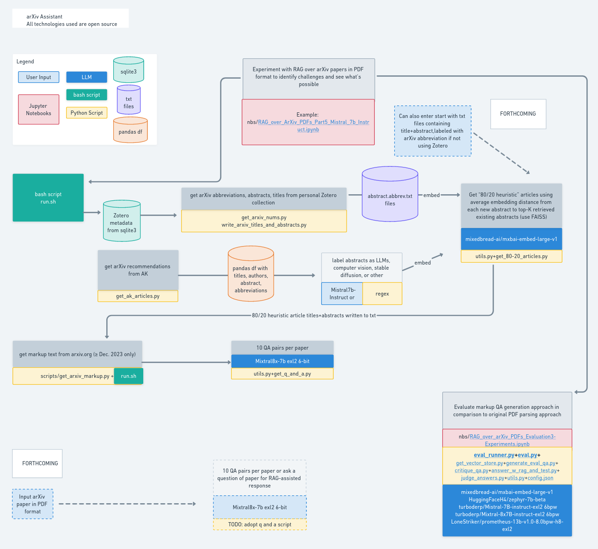

# arXiv LLMs Assistant

Image by author, made with [whimsical](https://whimsical.com)
## In Progress

### The goal is twofold:
    - Assist in studying the LLM domain by comparing out-of-repository papers with papers in a personal repo (in Zotero), then recommending new papers to read along with providing a list of question/answer pairs for each recommended paper
    - Run RAG over new papers, helping with generating questions to gain a deep understanding, for example
    
### Evaluation
    - The original starting point was a notebook on [RAG Evaluation](https://huggingface.co/learn/cookbook/en/rag_evaluation#evaluating-rag-performance) by HuggingFace.  
    - There are LLM multiple models involved in evaluation pipeline, and to fit it all on two 3090 GPUs, the code was refactored into scripts (so that each subprocess would release the GPU memory once done). 
    - In addition, to conserve memory and increase speed, 6bpw exl2 quantizations were used for Mistral and Mixtral due to their excellent [perplexity scores](https://huggingface.co/turboderp/Mixtral-8x7B-instruct-exl2).  
    - Finally, in the spirit of keeping all parts of the projects open source, Prometheus Eval was used (8bpw exl2) as an alternative to GPT-4 evaluation.
    
### Findings and observations
- It's best to preprocess the data by only loading the articles up to the References section as References were first to be retrieved otherwise, which is not useful
-   

   
